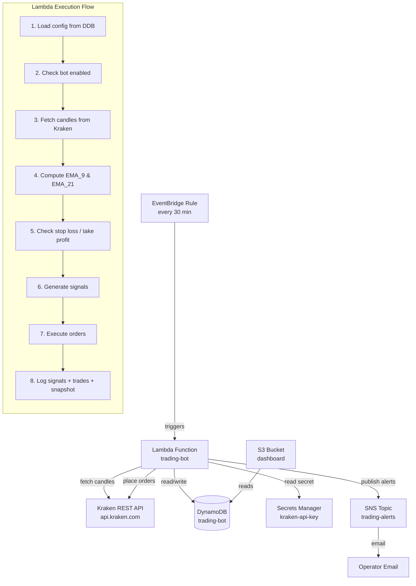
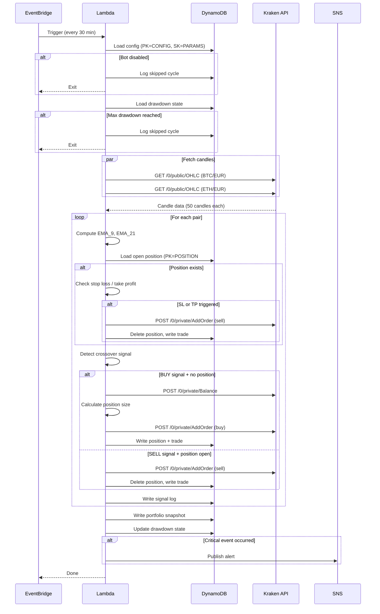

# Design Document: Trading Bot

## Overview

An automated cryptocurrency trading bot running as a single AWS Lambda function triggered every 30 minutes by EventBridge. It implements an EMA(9)/EMA(21) crossover strategy on 30-minute candles for BTC/EUR and ETH/EUR on the Kraken exchange.

The system is intentionally simple: one Lambda, one DynamoDB table (multi-entity), one EventBridge rule, one SNS topic for alerts, and Secrets Manager for the Kraken API key. Paper trading is handled locally (Kraken has no spot paper trading API — only derivatives have a demo environment), meaning the bot simulates order fills using the current market price without hitting the exchange's order endpoint.

### Key Design Decisions

1. **Single Lambda, single invocation** — Both pairs processed sequentially in one invocation to minimize cost and complexity.
2. **Single DynamoDB table** — Uses a single-table design with composite keys (PK/SK) to store config, signals, trades, positions, and portfolio snapshots.
3. **Local paper trading** — Since Kraken only offers demo APIs for futures/derivatives, paper trading simulates fills locally using the last close price.
4. **No external libraries for EMA** — The EMA formula is trivial (5 lines); we avoid pulling in a heavy TA library.
5. **CDK infrastructure** — Same pattern as the HA-SARL project (separate stack file, `aws-cdk-lib` v2).

## Architecture



### AWS Resources

| Resource | Name | Purpose |
|----------|------|---------|
| Lambda | `trading-bot` | Main execution (Node.js 20, 256 MB, 30s timeout) |
| EventBridge Rule | `trading-bot-schedule` | Triggers Lambda every 30 min |
| DynamoDB Table | `trading-bot` | All state: config, positions, signals, trades, snapshots |
| Secrets Manager | `trading-bot/kraken-api-key` | Kraken API key + private key |
| SNS Topic | `trading-bot-alerts` | Critical event notifications |
| S3 Bucket | `trading-bot-dashboard` | Optional static dashboard page |

## Components and Interfaces

### Project Structure

```
trade-robot/
├── package.json                 # Root package (scripts: build, test, deploy)
├── tsconfig.json
├── vitest.config.ts
├── cdk.json
├── infra/
│   ├── bin/
│   │   └── app.ts              # CDK app entry point
│   └── lib/
│       └── trading-bot-stack.ts # Single stack (all resources)
├── src/
│   ├── handler.ts              # Lambda handler entry point
│   ├── config.ts               # Load config from DynamoDB
│   ├── kraken/
│   │   ├── client.ts           # Kraken API client (auth, requests)
│   │   ├── types.ts            # Kraken API response types
│   │   └── endpoints.ts        # Endpoint constants
│   ├── strategy/
│   │   ├── ema.ts              # EMA calculation (pure function)
│   │   ├── signals.ts          # Crossover signal detection (pure function)
│   │   └── types.ts            # Signal types
│   ├── trading/
│   │   ├── order-manager.ts    # Order placement (live + paper)
│   │   ├── risk-manager.ts     # Position sizing, SL/TP, drawdown
│   │   └── types.ts            # Trade/Position types
│   ├── logging/
│   │   ├── trade-logger.ts     # DynamoDB write operations
│   │   └── types.ts            # Log entry types
│   ├── alerts/
│   │   └── notifier.ts         # SNS alert publisher
│   └── utils/
│       └── retry.ts            # Retry with exponential backoff
├── backtester/
│   ├── index.ts                # CLI entry point
│   ├── simulator.ts            # Simulates trades on historical data
│   └── report.ts              # Report generation (stats)
├── dashboard/
│   └── index.html              # Static S3 page (optional)
└── test/
    ├── strategy/
    │   ├── ema.test.ts
    │   ├── ema.property.test.ts
    │   └── signals.test.ts
    ├── trading/
    │   ├── risk-manager.test.ts
    │   └── order-manager.test.ts
    ├── backtester/
    │   └── backtester.property.test.ts
    └── config.test.ts
```

### Component Interfaces

```typescript
// --- src/strategy/ema.ts ---
export function computeEMA(prices: number[], period: number): number[];

// --- src/strategy/signals.ts ---
export type Signal = 'BUY' | 'SELL' | 'HOLD';
export interface SignalResult {
  signal: Signal;
  pair: string;
  ema9: number;
  ema21: number;
  closePrice: number;
  timestamp: number;
}
export function detectCrossover(
  ema9Values: number[],
  ema21Values: number[],
  pair: string,
  closePrice: number,
  timestamp: number
): SignalResult;

// --- src/trading/risk-manager.ts ---
export interface PositionSizeResult {
  size: number;
  stopLossPrice: number;
  takeProfitPrice: number;
  reason?: string; // set if trade skipped
}
export function calculatePositionSize(
  entryPrice: number,
  balance: number,
  config: RiskConfig
): PositionSizeResult;

export function checkStopLoss(position: Position, currentPrice: number): boolean;
export function checkTakeProfit(position: Position, currentPrice: number): boolean;
export function checkMaxDrawdown(peakValue: number, currentValue: number, maxDrawdownPct: number): boolean;

// --- src/trading/order-manager.ts ---
export interface OrderResult {
  orderId: string;
  pair: string;
  side: 'buy' | 'sell';
  size: number;
  price: number;
  timestamp: number;
  mode: 'LIVE' | 'PAPER';
}
export async function placeOrder(params: OrderParams): Promise<OrderResult>;

// --- src/kraken/client.ts ---
export class KrakenClient {
  constructor(apiKey: string, privateKey: string, baseUrl?: string);
  getOHLC(pair: string, interval: number, since?: number): Promise<Candle[]>;
  getBalance(): Promise<Record<string, number>>;
  addOrder(params: KrakenOrderParams): Promise<KrakenOrderResult>;
}

// --- src/config.ts ---
export interface BotConfig {
  enabled: boolean;
  mode: 'PAPER' | 'LIVE';
  pairs: string[];
  emaFastPeriod: number;
  emaSlowPeriod: number;
  stopLossPct: number;
  takeProfitPct: number;
  maxRiskPerTradePct: number;
  maxDrawdownPct: number;
  minBalanceEUR: number;
}
export async function loadConfig(ddb: DynamoDBDocumentClient, tableName: string): Promise<BotConfig>;
```

## Data Models

### DynamoDB Single-Table Design

**Table Name:** `trading-bot`  
**Billing Mode:** On-demand (pay-per-request, free tier friendly)  
**TTL Attribute:** `ttl` (epoch seconds, applied to signals/trades/snapshots — 365 days)

| Entity | PK | SK | Attributes |
|--------|----|----|------------|
| Config | `CONFIG` | `PARAMS` | enabled, mode, pairs, emaFastPeriod, emaSlowPeriod, stopLossPct, takeProfitPct, maxRiskPerTradePct, maxDrawdownPct, minBalanceEUR |
| Position | `POSITION#{pair}` | `OPEN` | pair, side, entryPrice, size, stopLossPrice, takeProfitPrice, openedAt, orderId |
| Signal | `SIGNAL#{pair}` | `{timestamp}` | signal, ema9, ema21, closePrice, cycleId, ttl |
| Trade | `TRADE#{pair}` | `{timestamp}` | side, size, entryPrice, exitPrice, pnl, fees, reason, orderId, mode, ttl |
| Snapshot | `SNAPSHOT` | `{timestamp}` | totalEquity, unrealizedPnl, realizedPnl, openPositionsCount, peakEquity, drawdownPct, ttl |
| Drawdown | `DRAWDOWN` | `STATE` | peakValue, currentValue, drawdownPct, disabled, disabledAt |

### Kraken API Endpoints

| Operation | Method | Endpoint | Auth Required |
|-----------|--------|----------|---------------|
| Get OHLC candles | GET | `/0/public/OHLC?pair={pair}&interval=30` | No |
| Get account balance | POST | `/0/private/Balance` | Yes |
| Place order | POST | `/0/private/AddOrder` | Yes |
| Get open orders | POST | `/0/private/OpenOrders` | Yes |

**Authentication (private endpoints):**
- Headers: `API-Key` (public key), `API-Sign` (HMAC signature)
- Signature: `HMAC-SHA512(path + SHA256(nonce + POST_data), base64_decode(private_key))`
- Nonce: strictly increasing integer (use `Date.now()`)
- Key pair stored in AWS Secrets Manager as JSON: `{ "apiKey": "...", "privateKey": "..." }`

**Kraken pair names:** `XXBTZEUR` (BTC/EUR), `XETHZEUR` (ETH/EUR)

### Candle Data Structure (from Kraken)

Kraken returns OHLC as arrays: `[timestamp, open, high, low, close, vwap, volume, count]`

```typescript
export interface Candle {
  timestamp: number;  // Unix seconds
  open: number;
  high: number;
  low: number;
  close: number;
  volume: number;
}
```

### EMA Calculation Algorithm

The EMA is computed iteratively over an array of closing prices:

```typescript
export function computeEMA(prices: number[], period: number): number[] {
  if (prices.length < period) return [];
  
  const k = 2 / (period + 1); // smoothing factor
  const emaValues: number[] = [];
  
  // Seed: SMA of first `period` prices
  let sum = 0;
  for (let i = 0; i < period; i++) {
    sum += prices[i];
  }
  emaValues.push(sum / period);
  
  // Iterate: EMA = close × k + prevEMA × (1 - k)
  for (let i = period; i < prices.length; i++) {
    const ema = prices[i] * k + emaValues[emaValues.length - 1] * (1 - k);
    emaValues.push(ema);
  }
  
  return emaValues;
}
```

**Properties:**
- Deterministic: same input always produces same output
- Output length: `prices.length - period + 1`
- Values converge toward the price series (bounded by min/max of inputs)

### Execution Flow (Every 30 Minutes)



### CDK Infrastructure

Single stack (`TradingBotStack`) containing all resources:

```typescript
// infra/lib/trading-bot-stack.ts (conceptual outline)
export class TradingBotStack extends cdk.Stack {
  constructor(scope: Construct, id: string, props?: cdk.StackProps) {
    super(scope, id, props);

    // DynamoDB table — single table, on-demand, TTL enabled
    const table = new dynamodb.Table(this, 'Table', {
      tableName: 'trading-bot',
      partitionKey: { name: 'PK', type: dynamodb.AttributeType.STRING },
      sortKey: { name: 'SK', type: dynamodb.AttributeType.STRING },
      billingMode: dynamodb.BillingMode.PAY_PER_REQUEST,
      timeToLiveAttribute: 'ttl',
      removalPolicy: cdk.RemovalPolicy.RETAIN,
    });

    // SNS topic for alerts
    const alertTopic = new sns.Topic(this, 'AlertTopic', {
      topicName: 'trading-bot-alerts',
    });
    alertTopic.addSubscription(new subs.EmailSubscription('operator@example.com'));

    // Reference existing Secrets Manager secret
    const krakenSecret = secretsmanager.Secret.fromSecretNameV2(
      this, 'KrakenSecret', 'trading-bot/kraken-api-key'
    );

    // Lambda function
    const fn = new lambda.Function(this, 'TradingBotFunction', {
      functionName: 'trading-bot',
      runtime: lambda.Runtime.NODEJS_20_X,
      handler: 'handler.handler',
      code: lambda.Code.fromAsset(path.join(__dirname, '../../dist')),
      memorySize: 256,
      timeout: cdk.Duration.seconds(30),
      environment: {
        TABLE_NAME: table.tableName,
        ALERT_TOPIC_ARN: alertTopic.topicArn,
        KRAKEN_SECRET_ARN: krakenSecret.secretArn,
      },
    });

    // Permissions
    table.grantReadWriteData(fn);
    alertTopic.grantPublish(fn);
    krakenSecret.grantRead(fn);

    // EventBridge schedule — every 30 minutes
    const rule = new events.Rule(this, 'ScheduleRule', {
      ruleName: 'trading-bot-schedule',
      schedule: events.Schedule.rate(cdk.Duration.minutes(30)),
    });
    rule.addTarget(new targets.LambdaFunction(fn));

    // Optional: S3 bucket for dashboard
    const dashboardBucket = new s3.Bucket(this, 'DashboardBucket', {
      bucketName: `trading-bot-dashboard-${this.account}`,
      websiteIndexDocument: 'index.html',
      publicReadAccess: true,
      blockPublicAccess: s3.BlockPublicAccess.BLOCK_ACLS,
      removalPolicy: cdk.RemovalPolicy.DESTROY,
    });
  }
}
```

### Configuration Schema (DynamoDB Item)

Stored as `PK=CONFIG, SK=PARAMS`:

```json
{
  "PK": "CONFIG",
  "SK": "PARAMS",
  "enabled": true,
  "mode": "PAPER",
  "pairs": ["XXBTZEUR", "XETHZEUR"],
  "emaFastPeriod": 9,
  "emaSlowPeriod": 21,
  "stopLossPct": 1.5,
  "takeProfitPct": 3.0,
  "maxRiskPerTradePct": 2.0,
  "maxDrawdownPct": 10.0,
  "minBalanceEUR": 10
}
```

**Defaults (used when field is missing/invalid):**

| Parameter | Default | Validation |
|-----------|---------|------------|
| enabled | `true` | boolean |
| mode | `"PAPER"` | `"PAPER"` or `"LIVE"` |
| pairs | `["XXBTZEUR", "XETHZEUR"]` | non-empty array of strings |
| emaFastPeriod | `9` | integer, must be < emaSlowPeriod |
| emaSlowPeriod | `21` | integer, must be > emaFastPeriod |
| stopLossPct | `1.5` | number, 0.1 – 10 |
| takeProfitPct | `3.0` | number, 0.1 – 20 |
| maxRiskPerTradePct | `2.0` | number, 0.1 – 10 |
| maxDrawdownPct | `10.0` | number, 1 – 50 |
| minBalanceEUR | `10` | number, > 0 |

### Backtester Design

The backtester is a local CLI script (not deployed to Lambda) that:

1. Fetches historical 30-min candles from Kraken's public OHLC endpoint (up to 720 candles per request, paginated with `since` parameter)
2. Feeds candles chronologically through the same `computeEMA()` and `detectCrossover()` functions
3. Simulates position opens/closes using close prices (no slippage model needed for paper)
4. Applies the same risk management rules (stop loss, take profit, position sizing)
5. Produces a JSON report:

```typescript
export interface BacktestReport {
  pair: string;
  startDate: string;
  endDate: string;
  totalTrades: number;
  winningTrades: number;
  losingTrades: number;
  winRate: number;        // winningTrades / totalTrades
  totalPnl: number;       // EUR
  maxDrawdown: number;    // percentage
  sharpeRatio: number;    // annualized
  avgTradeDuration: number; // minutes
  trades: BacktestTrade[];
}
```

**Usage:**
```bash
npx tsx backtester/index.ts --pair XXBTZEUR --from 2024-01-01 --to 2024-06-01
```


## Correctness Properties

*A property is a characteristic or behavior that should hold true across all valid executions of a system — essentially, a formal statement about what the system should do. Properties serve as the bridge between human-readable specifications and machine-verifiable correctness guarantees.*

### Property 1: Candle Parsing Correctness

*For any* valid Kraken OHLC response array (containing numeric values in the expected positions), parsing into a Candle object and then serializing back to the same array format SHALL produce values equal to the originals.

**Validates: Requirements 1.2**

### Property 2: EMA Values Bounded by Input Range

*For any* non-empty sequence of closing prices and valid EMA period, every computed EMA value SHALL be greater than or equal to the minimum price and less than or equal to the maximum price in the input sequence.

**Validates: Requirements 2.1**

### Property 3: EMA Matches Reference Implementation

*For any* sequence of closing prices (length >= period) and valid period, computing the EMA using our implementation SHALL produce values within 0.00000001 of a step-by-step reference implementation that applies `EMA = close × k + prevEMA × (1-k)` iteratively with SMA seeding.

**Validates: Requirements 2.2**

### Property 4: EMA Computation is Pair-Independent

*For any* two independent price series A and B, computing EMA(A) then EMA(B) SHALL produce identical results to computing EMA(B) then EMA(A) — the computation for one pair does not affect the other.

**Validates: Requirements 2.3**

### Property 5: EMA Format/Parse Round-Trip

*For any* valid sequence of closing prices, computing the EMA values then formatting each to a string (fixed decimal) then parsing back to numbers SHALL produce values within tolerance of 0.00000001 of the originals.

**Validates: Requirements 2.4**

### Property 6: Signal Detection Exhaustive Correctness

*For any* four values (prevEma9, prevEma21, currEma9, currEma21) where all are positive numbers, the detected signal SHALL be:
- BUY if currEma9 > currEma21 AND prevEma9 <= prevEma21
- SELL if currEma9 < currEma21 AND prevEma9 >= prevEma21
- HOLD otherwise

These three cases are exhaustive and mutually exclusive.

**Validates: Requirements 3.1, 3.2, 3.3**

### Property 7: Stop Loss and Take Profit Price Calculation

*For any* positive entry price and stop loss percentage (0.1–10%) and take profit percentage (0.1–20%), the calculated stop loss price SHALL equal `entryPrice × (1 - stopLossPct / 100)` and the take profit price SHALL equal `entryPrice × (1 + takeProfitPct / 100)`. The stop loss price SHALL always be less than the entry price, and the take profit price SHALL always be greater than the entry price.

**Validates: Requirements 5.1, 6.1**

### Property 8: Stop Loss and Take Profit Trigger Correctness

*For any* position with defined stopLossPrice and takeProfitPrice, and any positive currentPrice:
- Stop loss triggers if and only if currentPrice <= stopLossPrice
- Take profit triggers if and only if currentPrice >= takeProfitPrice
- If stopLossPrice < takeProfitPrice (always true by construction), at most one can trigger for any given price

**Validates: Requirements 5.2, 6.2**

### Property 9: Position Sizing Respects Risk and Balance Limits

*For any* positive portfolio value, positive entry price, positive stop loss distance, risk percentage (0.1–10%), and available balance, the calculated position size SHALL satisfy:
- `size × (entryPrice - stopLossPrice) <= portfolioValue × (riskPct / 100)` (risk limit)
- `size × entryPrice <= availableBalance` (balance limit)
- `size >= 0` (non-negative)

**Validates: Requirements 7.1, 7.2**

### Property 10: Peak Equity Tracking Invariant

*For any* sequence of portfolio value observations, the tracked peak value SHALL always equal the maximum value observed so far. After processing value V_n, peakValue = max(V_1, V_2, ..., V_n).

**Validates: Requirements 8.1**

### Property 11: Drawdown Detection Correctness

*For any* peak value and current value (both positive, current <= peak), the drawdown percentage SHALL equal `(peak - current) / peak × 100`, and the trading-disabled flag SHALL be true if and only if the drawdown percentage exceeds the configured maxDrawdownPct.

**Validates: Requirements 8.2**

### Property 12: Backtester Determinism

*For any* valid candle sequence and configuration parameters, running the backtester twice with identical inputs SHALL produce identical signal sequences and identical trade lists.

**Validates: Requirements 9.5**

### Property 13: Backtest Report Serialization Round-Trip

*For any* valid BacktestReport object, serializing to JSON then deserializing SHALL produce an object with equal field values (totalTrades, winRate, totalPnl, maxDrawdown, sharpeRatio, avgTradeDuration, and trades array).

**Validates: Requirements 9.6**

### Property 14: Config Defaults Applied for Missing Fields

*For any* partial configuration object (with any subset of fields missing or set to null/undefined), loading the config SHALL produce a valid BotConfig where every missing field has its documented default value, and every present valid field retains its original value.

**Validates: Requirements 13.3**

### Property 15: Config Validation Correctness

*For any* configuration object, validation SHALL:
- Reject if emaFastPeriod >= emaSlowPeriod
- Reject if stopLossPct is outside [0.1, 10]
- Reject if takeProfitPct is outside [0.1, 20]
- Accept if all three conditions pass

And for rejected configs, the system SHALL fall back to defaults for the invalid fields while preserving valid fields.

**Validates: Requirements 13.4**

### Property 16: Alert Throttling

*For any* sequence of alert events of the same type with timestamps within a 5-minute window, at most one alert SHALL be published. The first event triggers a publish; subsequent events of the same type within 5 minutes are suppressed.

**Validates: Requirements 15.3**

## Error Handling

### Strategy

| Error Scenario | Handling | Recovery |
|---------------|----------|----------|
| Kraken API 5xx / timeout | Retry 3× with exponential backoff (1s, 2s, 4s) | Skip cycle if all fail |
| Kraken API 429 (rate limit) | Wait Retry-After duration, then retry | Continue after wait |
| Kraken API 4xx (client error) | Log error, no retry | Skip operation, alert |
| Order rejection | Log reason + alert, no retry | Skip trade |
| DynamoDB write failure | Retry 3× with exponential backoff | Fall back to CloudWatch log |
| Lambda near-timeout (25s) | Graceful termination + alert | Next cycle resumes |
| Max drawdown reached | Disable trading + alert | Manual re-enable required |
| Invalid config | Use defaults + log warning | Continue with defaults |
| Insufficient balance | Skip trade + log reason | Retry next cycle |

### Atomicity Approach

The Lambda processes each pair independently. If processing pair A succeeds but pair B fails:
- Pair A's signals, trades, and position changes are committed
- Pair B's failure is logged; no partial state for pair B persists
- The portfolio snapshot reflects only successfully processed data

This is acceptable because the pairs are independent. Full transactional rollback across both pairs is unnecessary complexity for this use case.

### Retry Utility

```typescript
async function withRetry<T>(
  fn: () => Promise<T>,
  options: { maxRetries: number; baseDelay: number; multiplier: number }
): Promise<T> {
  let lastError: Error;
  for (let attempt = 0; attempt <= options.maxRetries; attempt++) {
    try {
      return await fn();
    } catch (error) {
      lastError = error as Error;
      if (attempt < options.maxRetries) {
        const delay = options.baseDelay * Math.pow(options.multiplier, attempt);
        await new Promise(resolve => setTimeout(resolve, delay));
      }
    }
  }
  throw lastError!;
}
```

## Testing Strategy

### Property-Based Testing

**Library:** [fast-check](https://github.com/dubzzz/fast-check) (TypeScript PBT library, mature, well-maintained)

**Configuration:** Minimum 100 iterations per property test.

**Tag format:** Each property test includes a comment: `// Feature: trading-bot, Property {N}: {title}`

Property tests cover the pure logic core:
- `src/strategy/ema.ts` — Properties 2, 3, 4, 5
- `src/strategy/signals.ts` — Property 6
- `src/trading/risk-manager.ts` — Properties 7, 8, 9, 10, 11
- `src/config.ts` — Properties 14, 15
- `src/alerts/notifier.ts` — Property 16
- `backtester/simulator.ts` — Properties 12, 13
- `src/kraken/types.ts` — Property 1

### Unit Tests (Example-Based)

Unit tests cover:
- Order placement logic (mock Kraken client)
- Paper vs live mode routing
- DynamoDB logging payloads
- Retry behavior (mock failures)
- Handler orchestration (integration of components)
- Config loading from DynamoDB

### Integration Tests

- Kraken API connectivity (candle fetch for real pair)
- DynamoDB read/write operations
- End-to-end handler execution with mocked external services

### Test Runner

**Vitest** (same as HA-SARL project) with `vitest --run` for CI execution.

```bash
# Run all tests
npx vitest --run

# Run only property tests
npx vitest --run test/**/*.property.test.ts

# Run backtester tests
npx vitest --run test/backtester/
```
